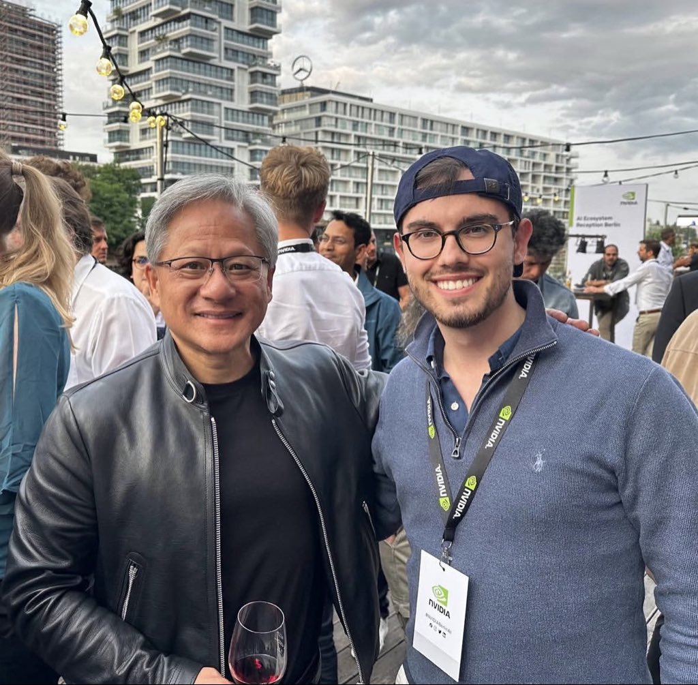

## [OpenSourceHuman.ai](https://opensourcehuman.ai/) Consciousness expansion, Cognitive Function, Health and Freedom / Harvard PGP / OpenHuman

[OpenSourceHuman.ai ](https://opensourcehuman.ai/) is a radical transparency initiative releasing full biological, neurological, and cognitive datasets into the public domain under the CC0 1.0 Universal license.  
Its goal is consciousness expansion, accelerate open research and to strengthen cognitive function (nervous system defense) by ensuring all data is freely accessible, verifiable, and reproducible.
This repository provides documentation, tools, and links for accessing and working with the published datasets.

---

## 📥 Direct Dataset Downloads (CC0)

All files are hosted at **https://opensourcehuman.ai/gallery/allfiles/**:

| File | Type |
|------|------|
| 📄 [VISA_24336764.pdf](https://opensourcehuman.ai/gallery/allfiles/VISA_24336764.pdf) | PDF |
| 📄 [passport.pdf](https://opensourcehuman.ai/gallery/allfiles/passport.pdf) | PDF |
| 📄 [EID_78419982370530.pdf](https://opensourcehuman.ai/gallery/allfiles/EID_78419982370530.pdf) | PDF |
| 📄 [Certificate of good conduct.pdf](https://opensourcehuman.ai/gallery/allfiles/certificate%20of%20good%20conduct.pdf) | PDF |
| 📄 [Transcript of Records+SKKU.pdf](https://opensourcehuman.ai/gallery/allfiles/Transcript%20of%20Records+SKKU.pdf) | PDF |
| 📄 [LeanderJohannesKahrens_Resume.pdf](https://opensourcehuman.ai/gallery/allfiles/LeanderJohannesKahrens_Resume.pdf) | PDF |
| 🧬 [NG1PJ23JBJ.mm2.sortdup.bqsr.hc.vcf.gz.tbi](https://opensourcehuman.ai/gallery/allfiles/NG1PJ23JBJ.mm2.sortdup.bqsr.hc.vcf.gz.tbi) | VCF Index |
| 🧬 [NG1PJ23JBJ.mm2.sortdup.bqsr.hc.vcf.gz](https://opensourcehuman.ai/gallery/allfiles/NG1PJ23JBJ.mm2.sortdup.bqsr.hc.vcf.gz) | VCF Gzip |
| 🧬 [NG1PJ23JBJ.mm2.sortdup.bqsr.hc.vcf](https://opensourcehuman.ai/gallery/allfiles/NG1PJ23JBJ.mm2.sortdup.bqsr.hc.vcf) | VCF |
| 🧬 [NG1PJ23JBJ.mm2.sortdup.bqsr.cram.crai](https://opensourcehuman.ai/gallery/allfiles/NG1PJ23JBJ.mm2.sortdup.bqsr.cram.crai) | DNA/CRAM Index |
| 🧬 [NG1PJ23JBJ.mm2.sortdup.bqsr.cram](https://opensourcehuman.ai/gallery/allfiles/NG1PJ23JBJ.mm2.sortdup.bqsr.cram) | DNA/CRAM |
| 📄 [Nebula Genomics.pdf](https://opensourcehuman.ai/gallery/allfiles/Nebula%20Genomics.pdf) | PDF |
| 📄 [LICENSE.txt](https://opensourcehuman.ai/gallery/allfiles/LICENSE.txt) | CC0 License (Text) |

## About Leander Johannes Kahrens

We champion radical transparency as the ultimate defense for personal freedom.  
By publicly sharing comprehensive biodata—full DNA sequences, MRI scans, PET imaging, and more—we overwhelm potential exploiters with verifiable truth, forging biofield defense and cognitive security for all.  

**Major surgeries include:** 

- Otoplasty (2016)  
- Septoplasty (2020)
- Chin Surgery (2021)  
- ReflEx Smile Eye Surgery (2024)  

**Nebula Kit:** NG1PJ23JBJ

**Harvad PGP ID:** hu4B4C92 
Leander is taking part in Harvard's "Personal Genome Project"
https://my.pgp-hms.org/profile/hu4B4C92

Why we publish Biodata? Biofield defense and Cognitive Security. Opensourcehuman.ai content is public domain (CC0).

### 📬 Connect & Contact

* **Instagram:** [@leanderjkahrens](https://instagram.com/leanderjkahrens)
* **X:** [@ljkx100](https://x.com/ljkx100)
* **Personal Mail:** [ljkahrens@protonmail.com](mailto:ljkahrens@protonmail.com)
<!--* **Project Mail:** [contact@opensourcehuman.ai](mailto:contact@opensourcehuman.ai) -->

**I created OpenSourceHuman because I needed cognitive security myself.**

In a world where information, identity, and perception can be manipulated at scale, the only real defense is radical transparency. By open-sourcing my entire self — my full DNA sequence, brain scans, bloodwork, medical records, passports, and lifelong biodata — I turn exposure into armor. When everything is public, verifiable, and timestamped, nothing can be twisted or weaponized against me. This is not surrender. This is sovereignty through openness.

**Cognitive security = being unhackable in mind and truth.**

**Religion:** I identify with most religions, but I don't follow any specific one.

[https://opensourcehuman.ai](https://opensourcehuman.ai) • CC0 1.0 Universal (Public Domain)  
Cognitive Freedom • Cognitive Security • Biofield Defense

